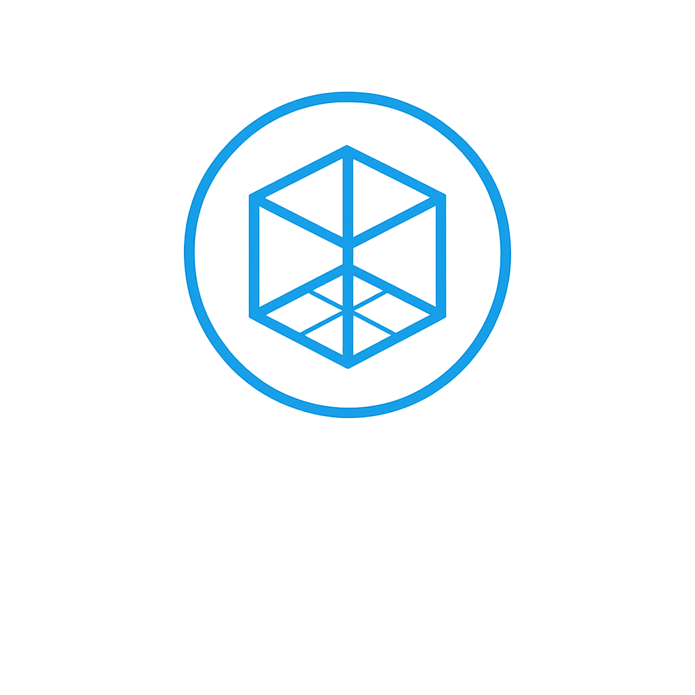

# Room Interior Designer MVP


## Overview
This project is a Minimum Viable Product (MVP) for a Room Interior Designer platform. The MVP enables users to capture a 360° photo of their room, extract approximate room dimensions using computer vision, and visualize an empty 3D wireframe of their room in a web interface.

---

## Step 1: Room Capture & Empty 3D Model

### Pipeline
1. **User uploads a 360° photo** (from the doorway) via the web frontend.
2. **Python FastAPI microservice** (with OpenCV) processes the image to estimate room dimensions.
3. **Room measurements** are stored in a PostgreSQL database via the Node.js backend.
4. **React + Three.js frontend** renders an empty 3D wireframe of the room using the extracted dimensions.

---

## Tech Stack
- **Frontend:** React (TypeScript), React-Three-Fiber, Three.js, Zustand
- **Backend:** Node.js (Express, TypeScript), PostgreSQL
- **Microservice:** Python (FastAPI, OpenCV)
- **3D/AR File Handling:** glTF, USDZ (future steps)
- **Storage:** S3-compatible (future steps)

---

## Directory Structure
```
backend/      # Node.js API server (Express, TypeScript)
frontend/     # React app (TypeScript, Three.js, Zustand)
microservice/ # Python FastAPI microservice (OpenCV, image processing)
```

---

## Current Progress (Step 1)
- [x] Project scaffolding for all major components
- [x] FastAPI microservice stub for image upload & processing
- [x] React components for photo upload and 3D wireframe rendering
- [x] Node.js backend route for storing/retrieving room measurements

---

## Next Steps
- Integrate the full pipeline: connect frontend upload → microservice → backend → frontend wireframe
- Improve measurement extraction accuracy
- Add error handling and user feedback

---

## Setup
See each subdirectory (`backend/`, `frontend/`, `microservice/`) for setup instructions and dependencies.

---

## License
See [LICENSE](LICENSE).

